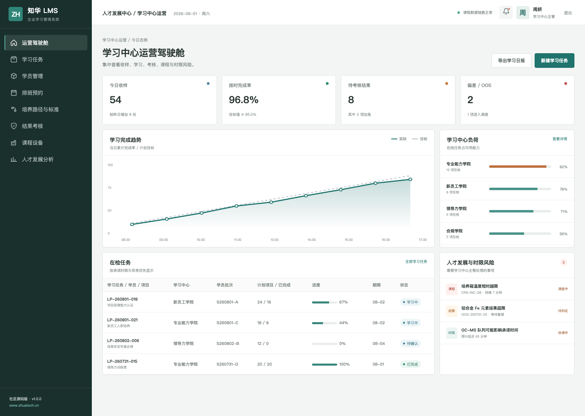
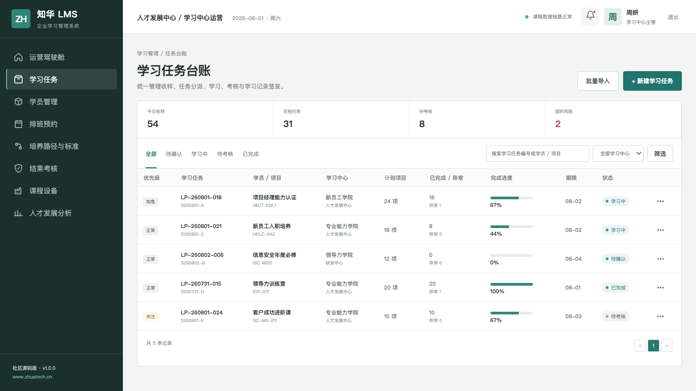
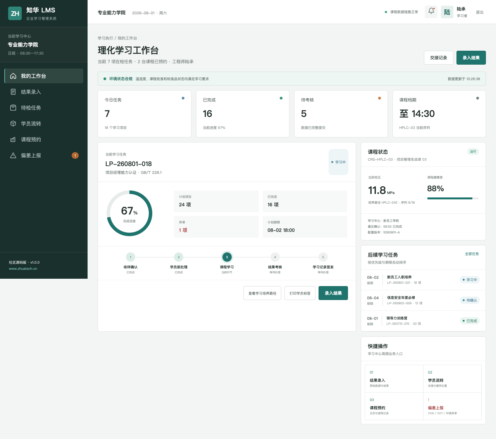

# 企业学习管理系统 / ZhuaTech LMS

> Learning Management System community source project by ZhuaTech

[](backend/pom.xml) [](frontend/package.json) [](compose.yaml) [](LICENSE)

## 项目说明

上海如静知华信息科技有限公司以真实企业岗位分工为背景构建了这套 LMS 社区源码版：从培养路径到课程、考核和学习记录，形成面向岗位能力的学习运营体系。 更多企业数字化方案请访问[知华科技官网](https://www.zhuatech.cn/)。

| 核心流程 | 使用角色 |
| --- | --- |
| 能力定义 → 培养计划 → 课程学习 → 在线考核 → 认证归档 → 效果分析 | 员工学员、培训管理员、课程负责人、系统管理员 |

## 页面与交互

### 学习运营驾驶舱



### 培养计划与课程台账



### 员工学习工作台



截图由仓库中的 Vue 应用实际运行后生成，展示的业务数据均为虚构演示数据。

## 能力清单

1. 学习项目、课程目录与培养路径
2. 报名排期、学习进度、考试与认证
3. 岗位能力、学习记录和运营报表

## 技术方案

| 部分 | 技术与职责 |
| --- | --- |
| 后端 | Java 21、Spring Boot、Spring Security、JPA、Flyway |
| 前端 | Vue 3、Pinia、Vue Router、Axios、Vite，响应式管理端与 H5 岗位端 |
| 数据 | MySQL 8；H2 集成测试 |
| 交付 | Docker Compose、Nginx、环境变量配置 |

Java 工程包名为 `cn.zhuatech.lms`，数据库名为 `zhuatech_lms`。角色覆盖员工学员、培训管理员、课程负责人、系统管理员。

## 开始运行

仅看演示界面：

```bash
cd frontend
npm install
npm run dev:demo
```

打开 `http://localhost:5173`。管理端账号 `planner / Demo@2026`，岗位端账号 `operator / Demo@2026`。

完整启动：

```bash
cp .env.example .env
# 修改数据库密码与 JWT_SECRET
docker compose up --build
```

## 新增：学习完成风险评估

新增 `POST /api/admin/completion-risk`，通过课程完成率、逾期课程、平均成绩、未活跃天数、强制课程和主管辅导次数计算风险，输出分级结果及干预动作，用于生成培训运营人员的重点跟进名单。

## 安全提醒

仓库中的账号、客户、指标、工单和经营数据均为虚构演示数据。正式落地时应更换默认密码与 JWT 密钥，配置 HTTPS、最小权限、数据库备份、操作审计、脱敏策略，并按照所在行业完成安全与合规评估。

## 授权方式

本工程仅允许个人、非商业性的学习、研究和技术交流，**不得商用**。企业内部使用、生产部署、SaaS、客户交付、收费培训、咨询实施及品牌替换，均须事先取得上海如静知华信息科技有限公司书面授权。完整条款见 [LICENSE](LICENSE)。

需要深度开发、私有化部署、系统集成或商业授权，请访问[知华科技官网](https://www.zhuatech.cn/)，也可扫码添加微信咨询：

| 微信咨询 1 | 微信咨询 2 |
| --- | --- |
|  |  |

关键词：LMS 源码、企业培训系统、在线学习、课程管理、Java LMS、Vue LMS、知华科技、上海如静知华信息科技有限公司。
